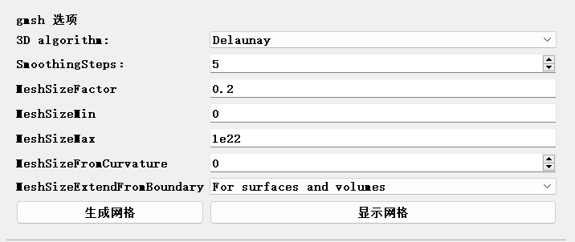
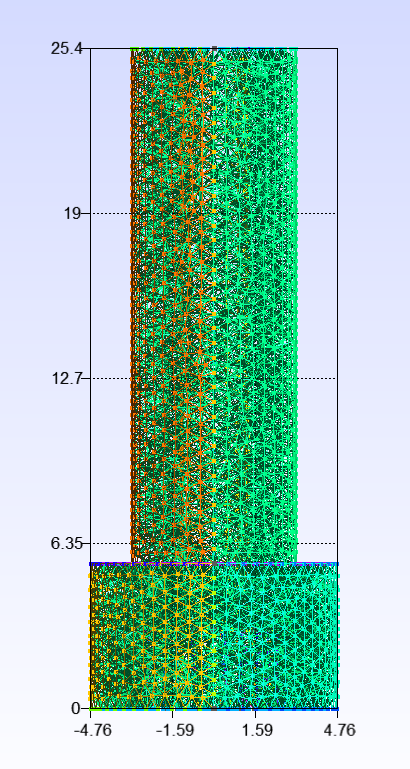
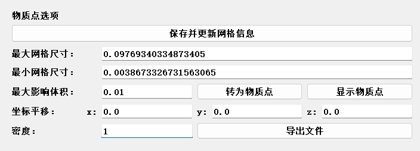
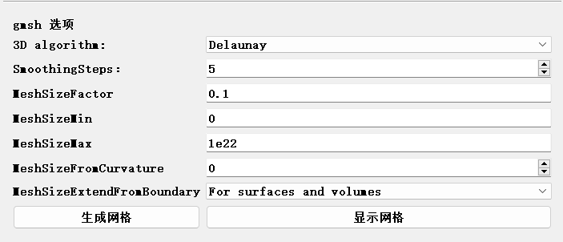
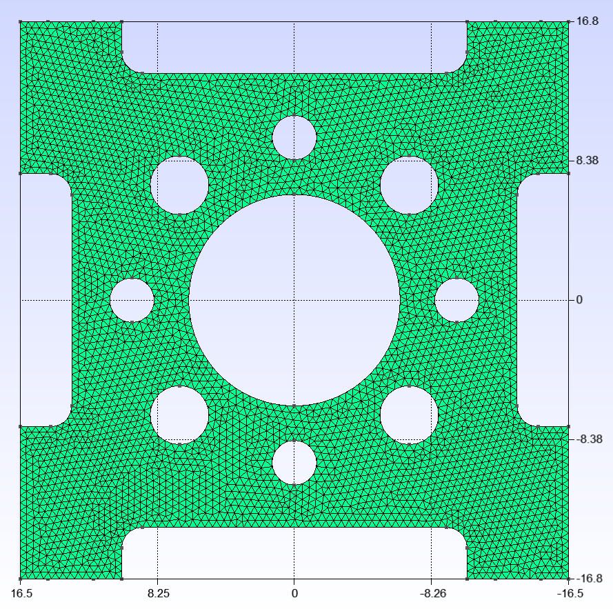
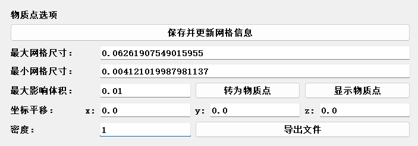
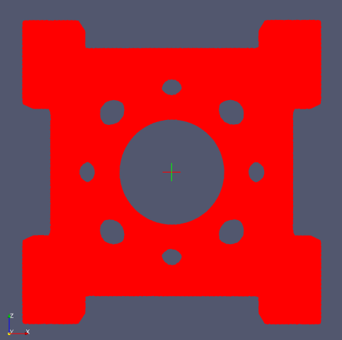

# CAD2Point软件使用说明书

## 1. 概述

CAD2Point是由清华大学航天航空学院计算动力学研究室开发的一款基于开源网格生成工具gmsh的预处理软件，主要用于对CAD模型进行网格划分，并将复杂CAD模型转化为物质点模型进行离散化。

软件的主要功能和特点包括:

- 支持导入STEP、STP、STL、IGES等多种CAD模型文件。

- 基于开源网格生成工具gmsh对CAD模型进行四面体网格划分。

- 提供了网格尺寸因子、最小最大尺寸、曲率自适应网格等控制参数，可灵活控制网格质量。

- 可将网格划分后的模型转化为物质点，并按照MPM3D软件中User-Defined格式导出为txt文件

- 简洁易用的图形化用户界面

## 2. 快速上手

1. 运行软件，在`CAD文件`模块下选择文件类型，点击`选择文件`，导入需要进行转换的CAD模型

2. 在`gmsh选项`中设置网格参数，点击`生成网格`进行网格划分
   
3. 点击`保存并更新网格信息`，读取并显示网格的最大最小尺寸

4. 输入`最大影响体积`，点击`转为物质点`生成物质点模型

5. 设置模型坐标偏移和密度参数,点击`导出文件`输出物质点信息文本文件

## 3. 功能介绍

### 3.1 CAD文件

支持STEP/IGES/STL等多种格式的CAD模型文件导入。

### 3.2 网格生成

基于开源网格生成工具gmsh,提供以下网格参数进行精确控制:

- **3D algorithm**:选择构建三维网格的算法,提供以下选项:

  - Delaunay算法:快速生成质量较好的Delaunay三角形网格

  - Frontal算法:逐层生成三维网格,通常质量较好,但计算时间长

  - Initial mesh only:只进行初步网格划分,不进行优化处理

  - MMG3D算法:调用MMG3D库进行网格优化重构,可以生成质量很好的网格

- **Smoothing Steps**:对网格进行Laplace光顺处理的迭代步数,一般设为1-5步,可以改进最终网格的质量。

- **Mesh Size Factor**:网格单元尺寸为模型几何特征尺寸的该因子倍数,默认为1倍。增大可生成更粗糙的网格,减小可得到更精细的网格。

- **Minimum Mesh Size**:网格单元尺寸的最小值,经过上述因子放大后,实际生成网格时不会小于该值。

- **Maximum Mesh Size**:网格单元尺寸的最大值,经过上述因子放大后,实际生成网格时不会大于该值。

- **Mesh Size From Curvature**:如果设为正值,将根据曲面曲率大小自动调整网格尺寸,以得到更合理的网格分布。该值表示每旋转2π弧度对应的目标网格单元数。

- **Mesh Size Extend From Boundary**:控制如何从模型边界向内部扩展网格尺寸的计算,提供以下选项:

  - For surfaces and volumes:既考虑边界曲面也考虑内部体积(默认)

  - For surfaces and volumes (use smallest length):既考虑边界曲面也考虑内部体积的特征尺寸,但在决定内部网格尺寸时,使用两者的最小值

  - Never:不扩展边界网格参数到内部

  - Only for surfaces:只考虑边界曲面特征
  
  - Only for volumes:只考虑内部体积特征

上述参数的详细说明可参考gmsh官方文档。本文档旨在帮助用户对主要参数有一个整体了解，以便快速上手。欲了解更多gmsh网格生成的细节，请参阅gmsh官网文档。

设置好网格参数后，点击界面上的`生成网格`按钮，执行网格生成，完成后，会弹出提示框显示"生成网格完成"。

点击`显示网格`按钮，将会调用gmsh显示生成的网格。
（注意：此时在gmsh中的操作并不会影响到程序中的网格生成结果）

### 3.3 网格信息更新

点击`保存并更新网格信息`按钮，程序将读取生成网格模型的节点坐标和四面体单元信息，并在`Maximum Mesh Size`和`Minimum Mesh Size`中显示最大最小单元体积。

此步骤为后续物质点模型转化提供基础数据。

### 3.4 物质点模型转化

点击`转换为物质点`按钮，将四面体网格模型转化为物质点集合

转化过程主要包括:

- 根据用户输入的“最大影响体积”参数,迭代处理所有四面体单元

- 对体积小于阈值的四面体,直接用其几何中心点来生成物质点

- 对体积大于阈值的四面体,进行递归分割生成更小的四面体

- 最终以所有较小四面体的中心点作为物质点添加到输出列表

- 在界面中显示转化得到的物质点总数、最大最小影响体积

注：转换物质点依赖于最后一次保存更新的网格信息

### 3.5 物质点可视化

点击`显示物质点`按钮，将在gmsh中进行可视化，便于检查物质点模型是否合理。

注:在实际运行中,gmsh显示大量物质点可能会出现卡顿。建议直接将生成的txt文件导入至MPM3D软件中进行查看。

### 3.6 物质点文件输出

设置好密度参数后，点击`导出文件`按钮，将物质点信息导出为txt文件，软件将会进行如下操作：

- 根据输入密度计算每个物质点对应的质量

- 按照设置的`x,y,z`值进行坐标平移

- 按照MPM3D中User-Defined格式导出为txt文件

注：物质点文件输出依赖于最后一次物质点转换的结果

## 4. 应用实例

示例模型均为STEP格式，存放于`examples`文件夹下

### 4.1 示例1

- 导入模型为`exapmle1.STEP`

- gmsh选项设置如图所示

- 生成网格如图所示

- 物质点选项如图所示，共生成121222个物质点

- 导入物质点模型如图所示，保存在`examples/example1.txt`中

### 4.2 示例2

- 导入模型为`exapmle2.STEP`

- gmsh选项设置如图所示

- 生成网格如图所示

- 物质点选项如图所示，共生成612624个物质点

- 导入物质点模型如图所示，保存在`examples/example2.txt`中

